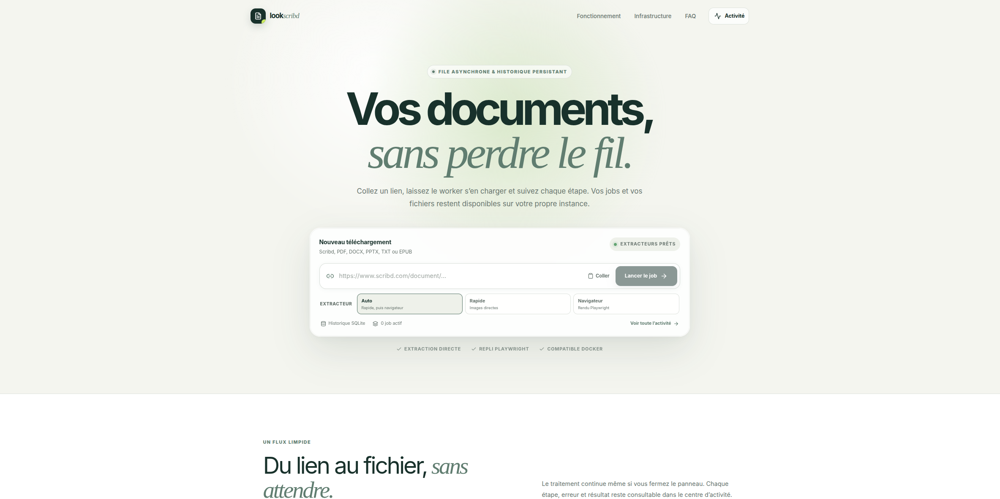

# Look Scribd

Interface auto-hébergée pour gérer des téléchargements de documents sous forme de jobs asynchrones. L’application utilise React + Vite pour l’interface, Express pour l’API et SQLite pour conserver la progression et l’historique.



## Fonctionnalités

- file de jobs asynchrone avec concurrence configurable ;
- progression, annulation, relance, journaux et historique persistant ;
- téléchargement serveur des URL directes PDF, DOCX, PPTX, TXT et EPUB ;
- choix `Auto`, `Rapide` ou `Navigateur` pour les liens Scribd ;
- extraction directe et parallèle des images, avec repli automatique vers l’export PDF Playwright ;
- protection contre les destinations réseau privées et limite de taille configurable ;
- interface responsive animée avec Framer Motion ;
- image Docker avec volumes séparés pour SQLite et les fichiers.

En mode `Auto`, le worker cherche d’abord les URL d’images exposées dans la page Scribd, les télécharge en parallèle et les assemble dans l’ordre. Si ces ressources ne sont pas disponibles ou sont incomplètes, il convertit le lien vers l’aperçu intégré, charge les pages par lots dans Chromium, les imprime avec Chrome DevTools Protocol et fusionne le résultat. Aucune session Scribd n’est nécessaire ; utilisez uniquement cette fonction pour des documents que vous avez le droit de consulter et de conserver.

L’extracteur rapide adapte en Node l’approche de [axrona/scribd-downloader](https://github.com/axrona/scribd-downloader). Le repli navigateur s’appuie sur l’approche de [themrsami/scribd-downloader](https://github.com/themrsami/scribd-downloader), tout en conservant Playwright et l’intégration TypeScript de l’application.

## Développement

Prérequis : Node.js 22.12 ou plus récent.

```bash
npm install
npm run browser:install
npm run dev
```

- interface Vite : [http://localhost:3434](http://localhost:3434)
- API Express : [http://localhost:3435/api/health](http://localhost:3435/api/health)

Les données sont créées dans `./data` et les fichiers dans `./downloads`.

## Docker

```bash
docker compose up --build -d
```

L’interface est disponible sur [http://localhost:7342](http://localhost:7342). Le port peut être changé avec `LOOK_SCRIBD_PORT`.

Comme `local-youtube`, le compose utilise deux montages persistants :

- `~/.look-scribd/data:/app/data` pour `jobs.sqlite` ;
- `~/Downloads/look-scribd:/app/downloads` pour les documents.

## Configuration

| Variable | Défaut | Rôle |
| --- | ---: | --- |
| `LOOK_SCRIBD_MAX_CONCURRENT` | `2` | Nombre maximal de jobs traités en parallèle |
| `LOOK_SCRIBD_MAX_FILE_MB` | `500` | Taille maximale d’un téléchargement direct ou d’un PDF exporté |
| `LOOK_SCRIBD_FAST_CONCURRENCY` | `10` | Nombre d’images téléchargées en parallèle par l’extracteur rapide |
| `LOOK_SCRIBD_BROWSER_TIMEOUT_MS` | `60000` | Délai maximal d’ouverture de l’aperçu |
| `LOOK_SCRIBD_PAGE_LOAD_TIMEOUT_MS` | `120000` | Délai de chargement d’un lot de pages Scribd |
| `LOOK_SCRIBD_RENDER_SETTLE_TIMEOUT_MS` | `30000` | Délai maximal de stabilisation du rendu d’une page |
| `LOOK_SCRIBD_EXPORT_BATCH_SIZE` | `8` | Nombre de pages Scribd conservées en mémoire simultanément |
| `LOOK_SCRIBD_BROWSER_PATH` | auto | Chemin d’un Chromium installé manuellement |
| `LOOK_SCRIBD_DATA_DIR` | `./data` | Répertoire de la base SQLite |
| `LOOK_SCRIBD_DOWNLOAD_DIR` | `./downloads` | Répertoire des fichiers |
| `LOOK_SCRIBD_PORT` | `7342` | Port hôte du service Docker |
| `TZ` | `Europe/Paris` | Fuseau utilisé dans les journaux du conteneur |

## Vérifications

```bash
npm run check
docker compose config
```
